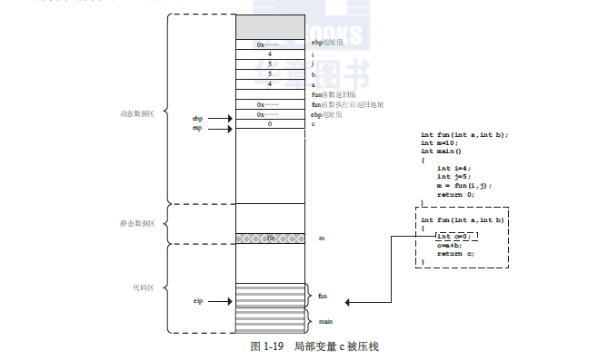

# 1.1 从一个简单c程序看函数调用压栈顺序

如图：



宏观上，上图中的这段代码再内存中有三个存储区域，代码区（`.text`)，静态数据区（`.data`），动态数据区（这里是`stack`）。

程序运行核心有三个寄存器，`eip`（指令寄存器），`ebp`（栈基址寄存器），`esp`（栈顶指针寄存器）。

其中`eip`永远指向代码区将要执行的下一条指令，它只有两种执行方式，一是顺序执行，二是跳转。

当代码被操作系统加载入内存时，内核设置`ebp`和`esp`的初始值，`eip`指向`main`函数的第一条指令。

我们从`main`函数调用`fun`函数看起。首先将子函数的参数从右到左顺序压栈，如果子函数有返回值，把返回值压栈。然后将子函数执行后的返回地址（下一条指令
地址）压栈，这个值表示子函数返回后，eip需要从哪里开始继续执行。最后要保存`ebp`的地址，这个是子函数执行完毕后恢复父函数`ebp`栈基址用的。然后
`ebp赋予`esp`的值，表示之前的栈顶成了现在子函数的栈基址。此时`ebp`和`esp`的值时相同的。接下来就是子函数的局部变量压栈，又是同样的逻辑循环，函数
调用都是这样的顺序，调用压栈，返回清栈。

可以说，在传参情况下，子函数的数据一半保存在父函数中，因为这些参数都是在父函数的栈中的！！！


函数返回有个特殊点，返回时，退栈在某一时刻`ebp`和`esp`都是指向保存`ebp`的值的位置，`ebp`地址值出栈后，`ebp`恢复，`esp`自动退栈，指向了子函数
的返回地址，之后执行**`ret`**指令（重要的`ret`指令），这个指令会把地址值传给`eip`，使之指向子函数执行后的返回地址！！！


# 1.2 更为复杂c程序的运行时结构

```c++
#include <stdio.h>
#include <string.h>

void fun1()
{
    int m =10;
    char num[4];
    strcpy(num,"bbbbbbbbbbbbb\x0F\x10\x40\x00");
}   

void fun2()
{
    printf("You were attacked!!!\n");
}

int main()
{
    fun1();
    return 0;
}
```
